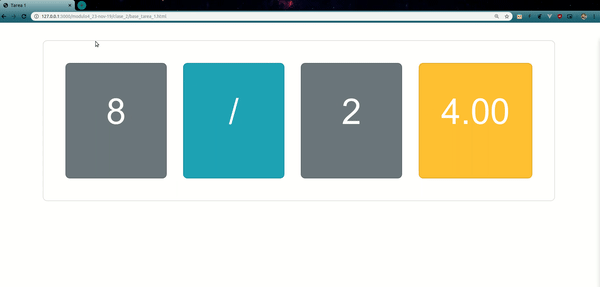

# Contenido a Entregar en su carpeta de clase_2:

## Ejercicios en Clase

### Ejercicio 1
1. Pedir información(prompt) del tipo de operación a realizar.
2. Pedir confirmación en caso de ser negativo ciclar hasta confirmar la operación.
3. Pedir dos valores que son los que se usaran para realizar la operación elegida.
4. Mostrar resultado.

### Ejercicio 2
1. Crear un arreglo que contenga objetos con la siguiente información al menos 5 objetos
[{name: , age, title}, {name: , age, title}, ........]
2. Preguntar que cliente busca (prompt())
3. Buscar en nuestro arreglo el nombre que busca (iterar sobre el arreglo en su búsqueda for)
4. Al encontrarlo, preguntar que información requiere, nombre, edad o titulo
5. Mostrar información.

### Ejercicio 3
1. Crear 5 elementos en una lista no ordenada.
2. Obtener todos los elementos(querySelectorAll).
3. Iterar y modificar 5 de sus características ya sean de estilo y contenido.

### Ejercicio 4
Utilizando base_ejercicio_4.html realizar las siguientes tareas:
1. Cambiar texto del título.
2. Cambiar padding  al elemento que tiene la clase row.
3. Cambiar el color a rojo al elemento con la clase red.

## Tareas

### Tarea 1
Utilizando base_tarea_1.html realizar las siguientes tareas:
1. Generar dos valores random con las siguientes condiciones:
	- El valor tiene que ser entero positivo validar que sea positivo si no lo es convertirlo(pista: usar objeto Math).
	- El valor no debe tener puntos decimales(pista: usar objeto Math).
2. Mostrar los dos valores en sus respectivas posiciones.(querySelector, getElementById)
3. Decir de manera aleatoria que operación se debe realizar ya sea, suma, resta, multiplicación y división.(pista: los arreglos tienen índices para decidir que posición se obtiene).
4. Mostrar operación en su respectivo lugar.(querySelector, getElementById)
5. Realizar la operación y mostrarla en su respectivo lugar con la condición de que siempre muestre un máximo de dos decimales.(pista: usar objeto Math sobre el resultado)

Ejemplo del resultado:

  

